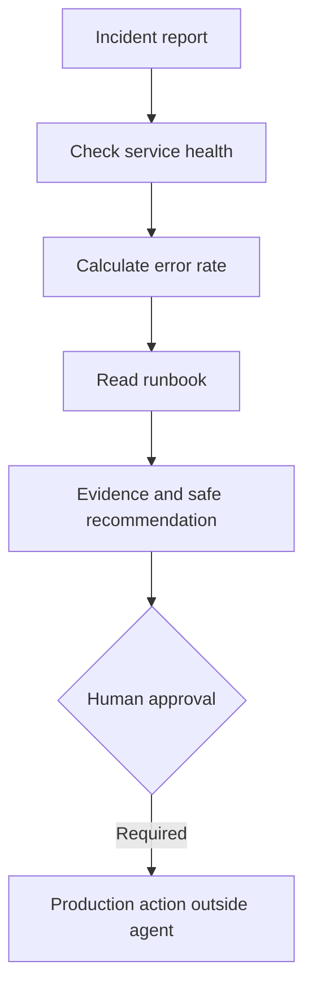
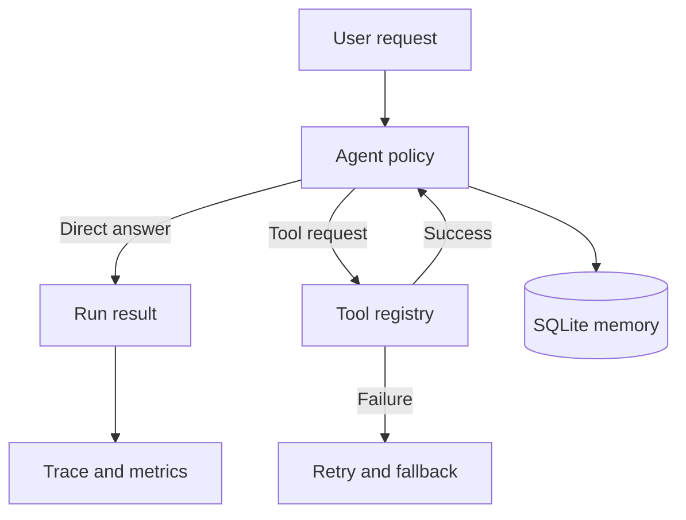

# Agent Reliability Lab

A compact Python project demonstrating the engineering layers around a tool-using agent: safe tool execution, persistent memory, retries, structured traces, repeatable evaluations, and an optional Google ADK/Gemini incident-triage agent.

## Why this project exists

Agent demos often show only a successful response. This project makes failures observable and measurable. It answers four practical questions:

1. Did the agent complete the task?
2. Which tools did it call?
3. What happened when a tool failed?
4. Did a change improve or regress behaviour?

## Features

- Explicit tool registry; unknown tools fail closed.
- Safe calculator without Python `eval`.
- Exponential-backoff retries and a controlled fallback response.
- SQLite memory scoped by user.
- Structured event traces for every run.
- Dataset-based regression evaluation with pass rate and latency.
- Offline deterministic policy, so tests require no API key.
- Google ADK agent with three operational function tools.
- Human approval boundary: the agent can investigate but cannot mutate production.

## Incident-triage workflow

The ADK agent investigates simulated `payments` and `identity` services. It can retrieve a health
snapshot, calculate error rate, and consult a runbook. The payments fixture is deliberately
degraded, giving the agent concrete evidence to reason about while keeping the demo reproducible.



## Architecture



## Quick start

```bash
python -m venv .venv
# Windows: .venv\Scripts\activate
# macOS/Linux: source .venv/bin/activate
pip install -e ".[dev]"
agent-lab run "calculate 12 * 4"
agent-lab eval
pytest
```

## Run with Google ADK and Gemini

```bash
pip install -e ".[adk,dev]"
cp .env.example .env
# Put your GOOGLE_API_KEY in .env, then expose the src directory:
adk web src
# Or run from the terminal:
adk run src/incident_agent
```

Try: `Payments are failing. Investigate the incident and recommend the next safe action.`

The API key is read from the environment and must never be committed. Unit tests deliberately do
not call Gemini, keeping CI deterministic and free.

## Evaluation

The evaluation suite includes successful arithmetic, unsupported requests, and a deliberate division-by-zero failure. The failure case proves that retries and safe fallback behaviour work as designed.

Add cases to `evals/cases.json`, run `agent-lab eval`, and inspect `reports/evaluation.json`. Keeping evaluation data separate from runtime code makes regressions visible during development.

## Engineering decisions

- **Deterministic default:** repeatable tests are more useful than unreliable demos.
- **Fail closed:** malformed or unknown tool calls never execute arbitrary code.
- **Bounded retries:** transient failures may recover, but retry loops cannot run forever.
- **Structured traces:** debugging uses events and metadata rather than scattered print statements.
- **SQLite memory:** persistence works locally without extra infrastructure.

## Known limitations and next steps

- Add OpenTelemetry-compatible trace export.
- Track token usage and real model cost.
- Add scheduled evaluations in GitHub Actions.
- Replace simulated health snapshots with an authenticated monitoring API.

## What I learned

Reliability is not just whether the model gives a plausible response. It requires controlled tool boundaries, observable failures, persistence, repeatable evaluations, and an explicit fallback when the system cannot safely finish a task.
